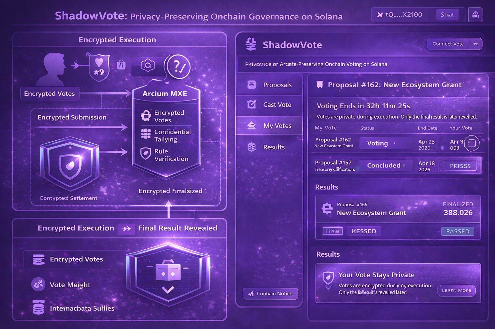
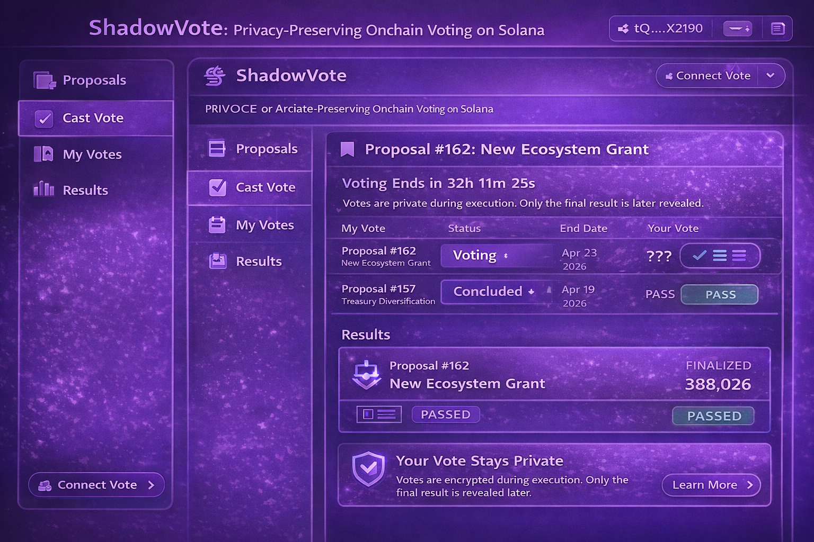

# ShadowVote (Solana + Arcium)

> ShadowVote explores how encrypted execution can enable fair onchain governance.

Most governance systems reveal votes before the final tally.

When votes are observable during voting, participants react to visible signals rather than expressing independent opinions.

ShadowVote proposes a different model.

Votes remain encrypted during execution.
Vote tallying runs inside Arcium MXE.
Only the final result is revealed on-chain.

---

## Problem

Onchain governance is transparent by default.

While transparency helps with verification, it also creates unintended effects:

- bandwagon voting
- social pressure
- vote buying
- strategic behavior

Participants react to visible vote counts instead of voting independently.

---

## Solution

ShadowVote separates execution confidentiality from settlement transparency.

Encrypted:
- individual votes
- vote weight
- intermediate tallies

Revealed:
- final vote result
- verified tally proof

---

## Arcium Integration

Arcium MXE performs:

- encrypted vote submission
- confidential vote tallying
- rule verification

Solana handles:

- proposal creation
- governance settlement
- final result recording

Arcium becomes the confidential execution layer for governance.

---

## Execution vs Settlement

Execution → private voting  
Settlement → public final tally

---

## Architecture

---

## Execution Flow

User casts encrypted vote  
↓  
Arcium MXE tallies votes privately  
↓  
Correctness proof generated  
↓  
Final result revealed on Solana

---

## UI Mock

---

## Disclaimer

ShadowVote is a structural prototype exploring encrypted governance execution using Arcium.

Not production-ready.
